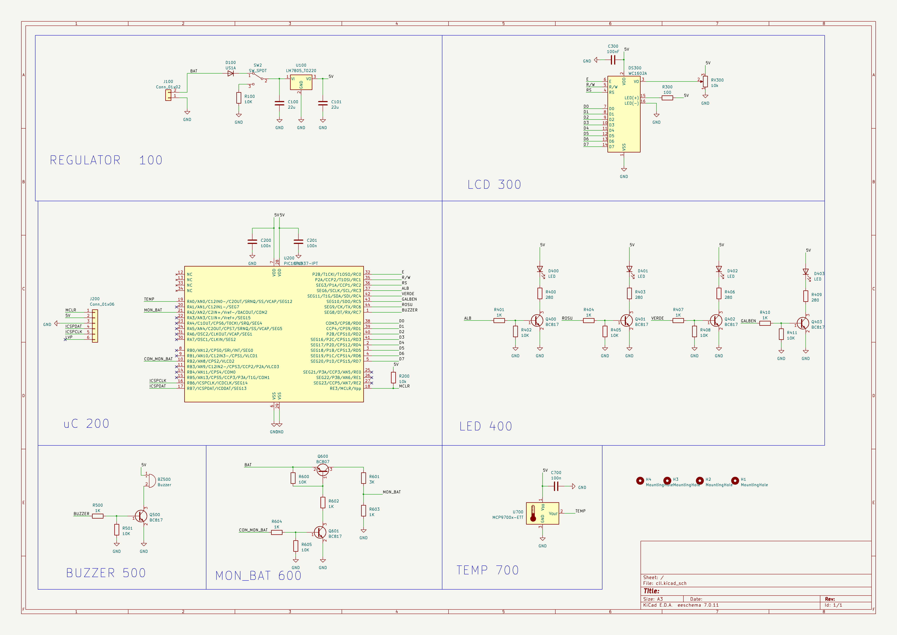
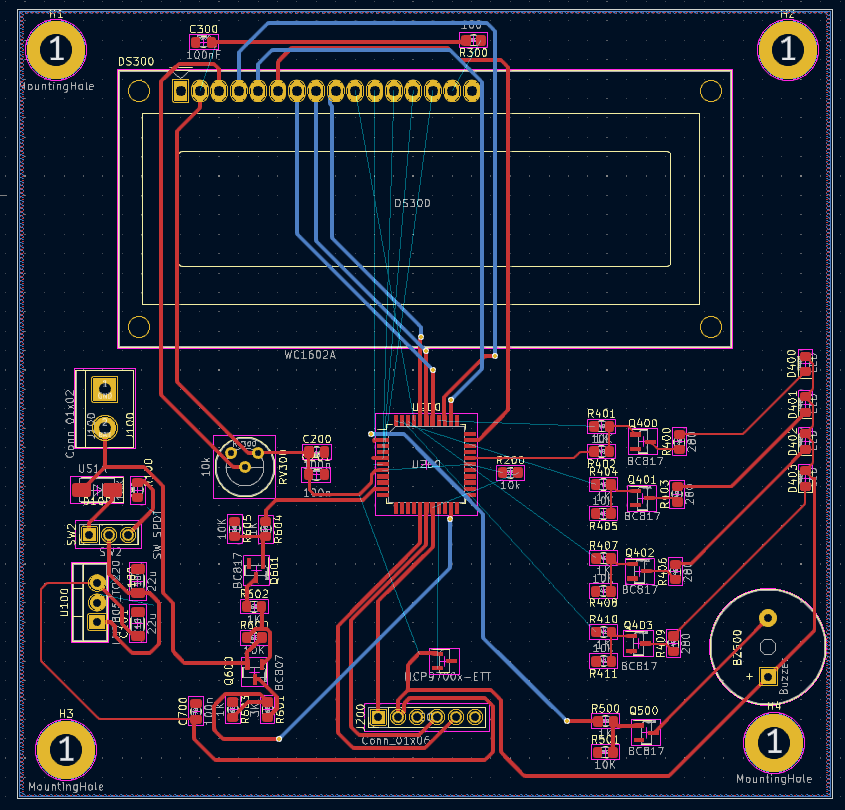

# Proiect PCB – Sistem embedded cu microcontroler, LCD și senzori

## Descriere
Acest repository conține proiectarea completă a unui **sistem embedded pe placă de circuit imprimat (PCB)**, realizat în KiCad. Proiectul integrează un **microcontroler**, un **afișaj LCD**, circuite de **semnalizare LED**, **buzzer**, monitorizare baterie și **senzor de temperatură**, precum și partea de **alimentare și reglare tensiune**.

Proiectul include:
- schematic electric modular
- layout PCB (rutare pe mai multe straturi)
- conectori, componente discrete și circuite auxiliare
- găuri de montaj și delimitări mecanice

---

## Schematic



---

## Layout PCB



---


## Tehnologii și unelte utilizate

- **KiCad** (schematic + PCB layout)
- Proiectare PCB
- Circuite digitale și analogice
- Alimentare stabilizată la 5V
- Microcontroler + periferice

---

## Structura funcțională a proiectului

```text
│   cll.kicad_pcb
│   cll.kicad_prl
│   cll.kicad_pro
│   cll.kicad_sch
│   cll.net
│   fp-info-cache

```
## Descrierea blocurilor funcționale

### REGULATOR 100

Blocul de alimentare asigură:

- protecția la polaritate inversă
- stabilizarea tensiunii de alimentare la **5V**
- filtrarea zgomotului prin condensatori de decuplare

Acest bloc furnizează tensiunea necesară tuturor modulelor din sistem.

---

### uC 200 – Microcontroler

Microcontrolerul reprezintă unitatea centrală de comandă și control:

- gestionează comunicația cu LCD-ul
- controlează LED-urile și buzzer-ul
- citește informații de la senzorul de temperatură
- monitorizează nivelul bateriei

Include:

- conector de programare/debug
- rezistențe și condensatori de decuplare
- pini dedicați pentru periferice

---

### LCD 300

Blocul LCD permite afișarea informațiilor către utilizator:

- date de stare
- mesaje informative
- valori măsurate

Conectarea este realizată printr-o interfață paralelă, cu rezistențe de limitare și control pentru iluminarea de fundal.

---

### LED 400

Circuitul de LED-uri este utilizat pentru semnalizare vizuală:

- stări de funcționare
- avertizări

Fiecare LED este comandat prin tranzistor și rezistențe de polarizare, asigurând protecția microcontrolerului.

---

### BUZZER 500

Blocul de buzzer oferă semnalizare acustică:

- alarme
- notificări sonore

Comanda este realizată prin tranzistor, permițând acționarea buzzer-ului fără suprasolicitarea pinilor microcontrolerului.

---

### MON_BAT 600 – Monitorizare baterie

Acest bloc permite:

- monitorizarea tensiunii bateriei
- generarea de semnale de avertizare pentru nivel scăzut

Circuitul este realizat cu tranzistoare și divizoare rezistive pentru adaptarea nivelului de tensiune.

---

### TEMP 700 – Senzor de temperatură

Blocul de temperatură include:

- senzor dedicat
- filtrare cu condensatori
- conectare directă la microcontroler

Permite citirea temperaturii ambientale și afișarea acesteia pe LCD.

---

## Layout PCB

Layout-ul PCB:

- este realizat respectând regulile de proiectare
- include rutare clară a semnalelor digitale și analogice
- folosește plane de masă pentru reducerea zgomotului
- include găuri de montaj pentru fixarea plăcii

Componentele sunt grupate logic, conform blocurilor funcționale din schematic.

---

## Rezultate

- schematic modular și ușor de urmărit
- layout PCB coerent și echilibrat
- separare clară între alimentare, logică și sarcini
- sistem complet integrat pe o singură placă

---
